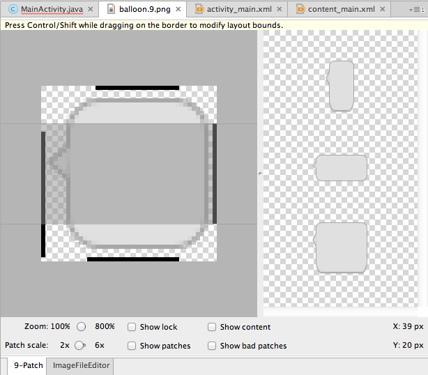
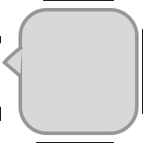
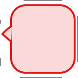

## Presented by dagezi

-  Quipperにいます
- 東南アジアで勉強アプリ出してます
- Recruitの子会社になりました
- エンジニア募集してます [Wantedly](https://www.wantedly.com/companies/quipper)


# 9patchの異常な仕様

あるいはなぜ私はドットを打つのをやめて

Scriptを書くようになったか


dagezi


## 9patch便利ですね

- 上下左右に伸びる
- 9分割じゃなくても大丈夫
- padding areaも指定できる


## でもメンテ面倒くさい!
すばやいイテレーションのためには、

画像の置き換えも当然必須だけど。


## デザイナー様から賜った絵をいじるの怖い
デザイナー様は点を打ってくれない


## エディタ使いにくい
個人の感想です




## dpiごとに必要





## バリエーションごとに必要 





## テストが面倒

- すべてのバリエーション
- すべての DPI

で試さないと!


# やってられない


## 作った

https://github.com/dagezi/gradle-android-9patch-plugin/


## コードでかける

```
ninepatch {
    balloon {
        src 'balloon'
        src 'balloon_red'
        vStretch 10, 12
        vStretch 24, 28
        hStretch 12, 32
        vPadding 8, -8
        hPadding 10, -8
    }
}
```


## すべてのバリエーション、dpiに点を打ってくれる


(もとの PNGはご用意ください)


## これだけ

```
buildscript {
    dependencies {
        classpath 'io.github.dagezi.ninepatch:plugin:0.0.2'
    }
}
```


## まとめ

> 9patchの差し替えが怖くなくなりました。

個人の感想です
